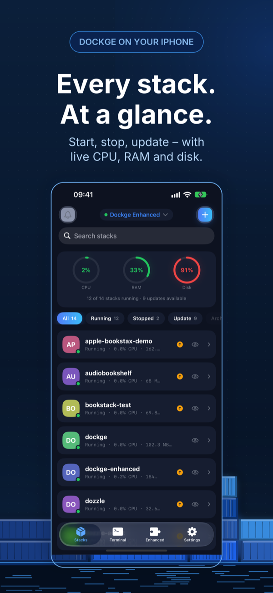
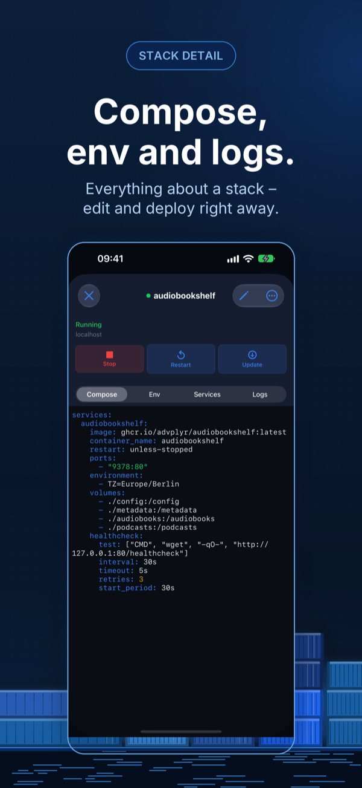
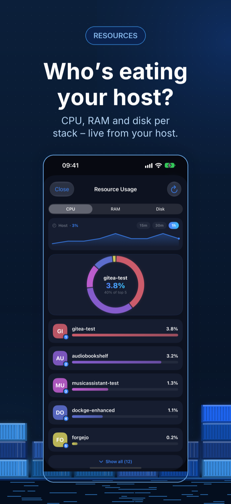
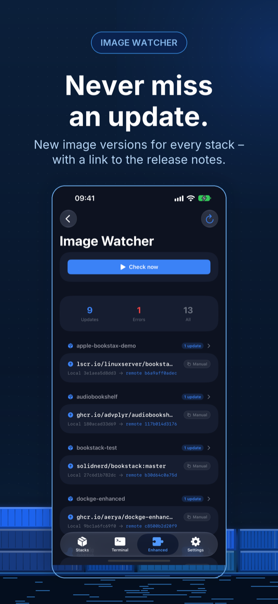
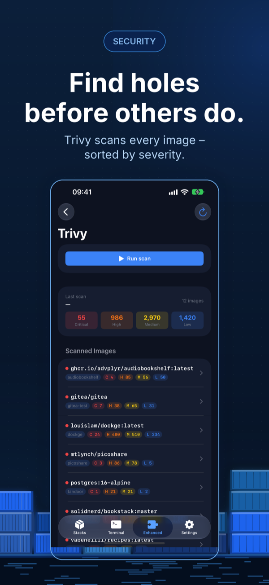
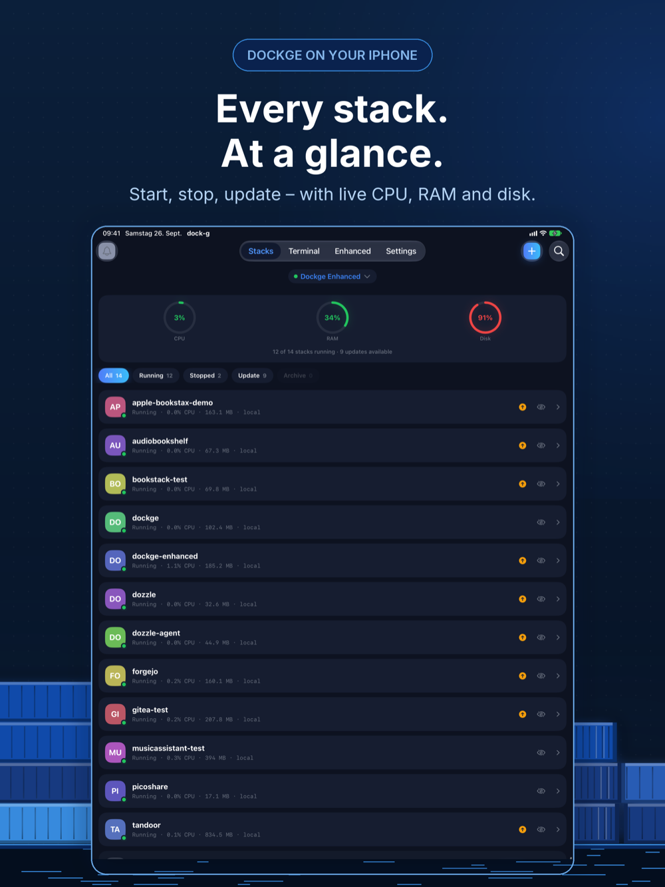

  

<h1 align="center">dock-g</h1>

  <strong>An unofficial, independent app for <a href="https://github.com/louislam/dockge">Dockge</a> and <a href="https://github.com/aerya/dockge-enhanced">Dockge Enhanced</a>.</strong> 
  Not affiliated with, developed, endorsed or reviewed by the maintainers of Dockge and Dockge Enhanced.

<strong>Your Docker stacks. In your pocket.</strong>

  A native SwiftUI companion for <a href="https://github.com/louislam/dockge">Dockge</a> and <a href="https://github.com/aerya/dockge-enhanced">Dockge Enhanced</a> — manage your self-hosted Docker Compose stacks on iPhone and iPad.

  <a href="https://apps.apple.com/app/id6762023227?pt=128697224&ct=github-readme&mt=8">Download on the App Store</a>
  ·
  <a href="https://www.dock-g.app/en/">Website</a>
  ·
  <a href="https://www.dock-g.app/en/changelog/">Changelog</a>
  ·
  <a href="https://github.com/apps4selfhosted/dock-g/releases">Releases</a>
  ·
  <a href="https://github.com/apps4selfhosted/dock-g/issues">Report an issue</a>

---

> dock-g is a community project by Sven Hanold. It is not part of the official Dockge and Dockge Enhanced
> projects. The names Dockge and Dockge Enhanced are used here only to say what this app connects to —
> with respect and thanks to the people who build and maintain them.

## Screenshots

<table>
  <tr>
    <td align="center"></td>
    <td align="center"></td>
    <td align="center"></td>
    <td align="center"></td>
    <td align="center"></td>
  </tr>
  <tr>
    <td align="center">Stacks</td>
    <td align="center">Stack detail</td>
    <td align="center">Resources</td>
    <td align="center">Image Watcher</td>
    <td align="center">Trivy</td>
  </tr>
</table>

 iPad

## What it does

dock-g is the native iOS companion for Dockge, the popular self-hosted Docker stack manager —
built for homelab enthusiasts who want full control over their containers, wherever they are.

**Stacks at a glance.** All running stacks with live CPU, RAM and disk usage. Start, stop, restart,
update or remove stacks in seconds, create new ones, and dive into compose YAML, environment
variables, service status and live logs. The resources view ranks usage per stack with a donut
chart, so resource hogs stand out immediately.

**Dockge Enhanced.** dock-g detects Dockge Enhanced automatically and unlocks advanced monitoring:
a dashboard for backups, pending image updates, critical CVEs and the next scheduled scan; the
Image Watcher for updates across all stacks; Trivy CVE scans by severity; Restic backups with
snapshot browsing and restore; Docker resource management; and crash-loop detection with ignore
rules.

**Built-in SSH terminal.** A full SSH client built on Apple's Network.framework and CryptoKit, for
the local network only. Host keys are verified trust-on-first-use and stored in the Keychain, a
special-keys bar brings Ctrl, Tab, Esc and arrow keys to the iPhone, and you can jump straight into
any running container via docker exec.

**Privacy by design.** A one-time purchase — no subscription, no tracking. Your server credentials
never leave your device; authentication tokens live only in the iOS Keychain.

## Requirements

- A running [Dockge](https://github.com/louislam/dockge) 1.x or [Dockge Enhanced](https://github.com/aerya/dockge-enhanced) server
- iOS / iPadOS 26.0 or later
- Paid app, one-time purchase — no subscription.

## Support

This repository is the public place for bug reports and feature requests:

- 🐞 [Report a bug](https://github.com/apps4selfhosted/dock-g/issues/new?template=bug_report.yml)
- 💡 [Request a feature](https://github.com/apps4selfhosted/dock-g/issues/new?template=feature_request.yml)
- ❓ [Frequently asked questions](https://www.dock-g.app/en/faq/)

Prefer not to post publicly? The [support form](https://www.dock-g.app/en/support/) reaches the
same place privately. Replies usually within one to two days.

The app's source code is not hosted here — this repository exists for support, documentation and
releases.

## Related apps

Other native iOS clients for self-hosted services, by the same developer:
[Mobile MA](https://www.mobile-ma.app/) (Music Assistant) ·
[gyokuro](https://www.gyokuro.app/) (Gitea/Forgejo) ·
[BookStax](https://www.bookstax.app/) (BookStack) ·
[picaroa](https://www.picaroa.app/) (PicoShare) ·
[DockTrace](https://www.docktrace.app/) (Dozzle)

---

© 2026 Sven Hanold · Apps4Selfhosted

